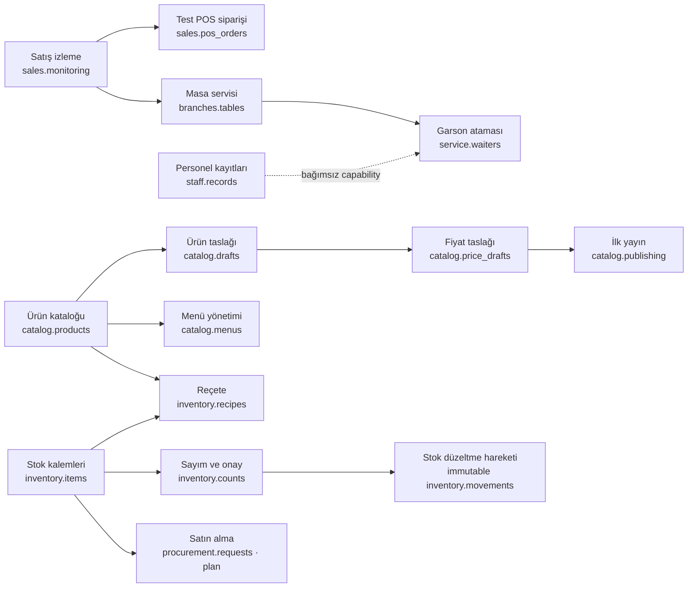

# HIPOS backend mimarisi ve modül bağımlılıkları

Durum: 8 Ekim 2026. Bu belge mevcut kodu, veritabanı şemalarını, capability bağımlılıklarını ve henüz yapılmamış işleri tek yerde toplar. Eski tasarım metinleri ürün niyetini anlatabilir; uygulama durumu için bu belge ve [durum/yol haritası](DURUM_VE_YOL_HARITASI.md) esas alınır.

## Ürün odağı

İlk tanıtım, tek şubeli bir restoran yöneticisinin günlük işini anlayabileceği basit bir paneldir. Örnek işletme Mahalle Fırını / Kadıköy Şubesi’dir. Demo kişi, sipariş ve hareketler kurgusaldır. Yönetici başlangıç ekranı temel durumu ve sık kullanılan işlere geçişi vermeli; uygulanmamış işleri çalışan özellik gibi göstermemelidir.

Öncelik sırası: ortak veri ve modül kuralları → müşteri/tedarikçi carisi → reçete, stok hareketi ve onaylı sayım → şube bazlı personel kartları. Gerçek tahsilat, üretim KDS’i, kişi bazlı mutfak performansı, web sitesi yayını, gelişmiş yetkilendirme ve çok şubeli merkez yönetimi sonraki aşamalardır. Personel kartı çalışma saati/performans verisi değildir.

## Teknoloji ve çalışma şekli

| Katman | Kullanılan teknoloji | Görevi / sınırı |
|---|---|---|
| Yönetim paneli | React 19, TypeScript, Vite 8, React Router 7, lucide-react | Yönetici görünümü, form ve okuma ekranları. Ekran gizleme güvenlik kontrolü değildir. |
| API | .NET 10 / ASP.NET Core 10, C# | Geliştirme API’si; firma/şube kapsamı, iş kuralları ve modül kapıları. |
| Kalıcılık | EF Core 10.0.12, Npgsql EF Core 10.0.3, PostgreSQL | Her iş alanı kendi şemasını ve migration’ını yönetir. Tek yerel veritabanı kullanılır. |
| Otomatik test | Node.js `node:test`, Vitest 5, Playwright 1.63 | Birim, HTTP, tarayıcı ve geçici PostgreSQL senaryoları. |
| Demo başlangıç verisi | `contracts/demo-single-branch.v1.json`, `scripts/seed-demo.mjs` | Sabit kimlikli ve tekrar çalıştırılabilir kurgusal katalog/cari/servis/stok/reçete/sayım verisi. |

API ve panel için temel çalışma bağımlılıkları Node.js `>=22.12`, npm workspaces, .NET 10 SDK ve yerel PostgreSQL’dir. Paket sürümlerinin kesin kaynağı kök ve uygulama `package.json` dosyaları ile `apps/api/Hipos.Api/Hipos.Api.csproj` dosyasıdır. Migrations önce ayrı deployment/kurulum adımıyla uygulanır; modül açma-kapama migration çalıştırmaz. `X-Demo-Actor` yalnız Development içindir ve üretim kimlik doğrulaması sayılmaz.

## Modül sahibi, şema ve bugünkü durum

| Modül | PostgreSQL şeması | Sahip olduğu veri | Durum |
|---|---|---|---|
| Özellik yönetimi | `modules` | Şube bazlı tercih, etkin yeni iş durumu, sürüm ve audit | PostgreSQL’de çalışıyor; kullanıcı/rol kimliği demo. |
| Ürünler ve Menü | `catalog` | Kategori, ürün, fiyat sürümü, yayın anlık görüntüsü, taslak, menü, menüye özel adlandırılmış bölümler ve sıralı ürün bağları | Liste/detay, taslak, fiyat sürümü ve ilk yayın yanında; mevcut ürünleri farklı katalog kategorilerinden seçip özel menü başlığı altında yeniden kullanma, menü sıralama ve aktif menü seçimi API’ye bağlı. Menü yeni ürün/fiyat kopyası üretmez. |
| Satış ve Adisyon | `sales` | Sipariş, kalemler, fiyat anlık görüntüsü, simüle ödeme girişimi | API'de Test POS/servis siparişleri PostgreSQL'de ve salt okunur izlenir; bu şema şimdilik yalnız açık sipariş ve simüle ödeme durumlarını destekler, kapanış/tahsilat yoktur. Mock panelde Satış Özeti, Adisyonlar ve Açık Adisyonlar birbirinden ayrı, örnek veri etiketiyle gösterilir. Mock kapanış/ürün/garson ayrıntıları veritabanına yazılmaz. |
| Personel ve Masa Servisi | `service` | Şube kapsamlı personel, masa, personel-adisyon bağı ve audit | `staff.records` personel kartını; `branches.tables`/`service.waiters` masa-servis bağını yönetir. Panel bölüm/görev kartı CRUD ve ayrı çalışan ızgaraları sunar. Bordro, puantaj, POS kimliği yok. |
| Cari | `cari` | Müşteri/tedarikçi kartı ve iletişimi, semantik hareket defteri, ekstre, audit | PostgreSQL'de kalıcı; müşteri ve tedarikçi capability'leri ayrı. Tahsilat/ödeme elle girilen işletme kaydıdır; banka/POS/fatura değildir. |
| Reçete ve stok | `inventory` | Depo, hammadde/eşik, değiştirilemez hareket defteri, reçete sürümleri, sayım snapshot/onayı ve denetim | `InventoryDbContext` migration, API, demo seed ve PostgreSQL kabul testi var. İlk örnek tek şube/tek depo; depo kimliği hareket/sayım kapsamındadır. Satıştan otomatik tüketim ve satın alma belgesi yok. |
| Mutfak/KDS, satın alma, kasa, finans, rapor | henüz yok | İlgili iş verileri | Örnek/planlanan alanlar; çalışan backend olarak sunulmaz. |

### Capability bağımlılıkları



Grafik işletme tercihi bağımlılıklarını gösterir; kod modüllerinin veri sahipliğinin yerine geçmez. Capability kataloğunun asıl anahtarları [ortak sözleşmededir](contracts/feature-catalog.v1.json). `availability: backend_preview`, gerçek kullanıcıya hazır olunduğu anlamına gelmez.

| Kural | Sonuç |
|---|---|
| `branches.tables` kapatılır | Yeni masa işlemi reddedilir; `service.waiters` tercihi de otomatik kapanır. Satış siparişi modülü açık kalabilir. |
| `staff.records` kapatılır | Yeni personel yazma/düzenleme durur; çalışan kartları ve geçmiş atamalar silinmeden okunur. Masa servisine bağımlı değildir. |
| `service.waiters` kapatılır | Yeni garsonlu masa bağı açılmaz; geçmiş adisyon üzerindeki garson adı korunur. |
| Masa servisi kapalıyken | Şu an veritabanındaki masa ve bağ kayıtları silinmez ve API geçmiş olarak okumaya devam eder. Panelin bunları nasıl sunacağı ayrı ürün kararıdır; operasyonel masa planı olarak göstermesi yanıltıcıdır. |
| Masa-adisyon bağı kapatılır | Satış siparişi veya ödeme kaydı kapanmaz/değişmez. Satış adisyonu masa olmadan da açılabilir. |
| `inventory.items` kapatılır | Yeni hammadde, movement ve reçete yazmaları ilgili bağımsız feature gate tarafından reddedilir; geçmiş kayıtlar API'den okunabilir. |
| Açık sayım varken `inventory.items` veya `inventory.counts` kapatılır | `409 INVENTORY_COUNT_OPEN`; tercih açık kalır. Taslak snapshot korunur. Önce sayım onaylanmalı veya denetimli iptalle kapatılmalıdır. |
| Sayım açıkken hareket | Normal API hareketleri `409 COUNT_IN_PROGRESS` ile reddedilir. Snapshot dış bir yazmayla değişmişse onay `409 COUNT_STOCK_CHANGED` döndürür ve düzeltme yazmaz. |
| Sayım onayı | İki capability (`inventory.items` ve `inventory.counts`) açık olmalı. Fark başına tek idempotent `count_adjustment` hareketi üretilir. |
| Kritik stok | Tek kural `onHand < criticalBelow`; eşik uyarıdır, miktar değildir. Dashboard listeyi `/critical-stock` API'sinden alır, kendi hesabını yapmaz. |
| Teorik üretim | Her reçete kaleminde `floor(onHand / recipeQuantity)` ve minimum kapasite gösterilir. Birimler eşleşmiyorsa tahmin yoktur; fire/bozulma/başka ürün tüketimi dahil değildir. |
| Reçete kaydı | Her kaydetme yeni sürüm oluşturur; reçete ürün ve şube kapsamındaki aktif hammaddelere bağlanır. Otomatik tüketim yapmaz. |
| Personel/kitchen raporu | Güvenilir zaman kaydı olmadan çalışan başına süre veya performans hesaplanmaz. |

Tek şube MVP'sinde şube listesindeki kapasite/masa bilgisi ile masa planı tek API kaynağında birleştirilmiş değildir; garson kartından sorumlu masaları listeleme de tamamlanmadı. Bunlar envanterden bağımsız, kabul testli açık işlerdir.

### Açık iş kuralı

Masa servisini kapatma, devam eden açık masa-adisyon bağlarını şu an `draining` yaşam döngüsüne bağlamıyor. Feature store’daki genel `inFlightWorkCount` bu servis atamalarından hesaplanmıyor. Bu nedenle backend tarafında güvenli kapatma tamamlanmış değildir. İstenen hedef: yeni bağları hemen durdurmak, mevcut bağları güvenle bitirmeyi sağlamak, sonra capability’yi tamamen kapatmak; bağlı garson özelliğini de yeni atama için devre dışı tutmak. Masa ve garson kartlarının ana ekrandaki görünürlüğü için karar verilene kadar kayıt silinmemelidir.

## İş alanları arası kurallar

- **Ürün → satış:** Sipariş kalemi ürün adı/fiyatının satış anındaki kopyasını saklar. Sonraki fiyat değişimi eski siparişi değiştirmez.
- **Satış → servis:** Servis modülü siparişi okuyup ayrı `service.assignments` kaydıyla masaya bağlar. Satış tablosunun sahibi satış modülüdür.
- **Servis → garson:** Atama isteğe bağlı garson kimliği taşır; garson çalışma süresi takip edilmez.
- **Satış → ödeme:** Mevcut ödeme simülatörü yalnız durum senaryosu yazar. Banka, nakit tahsilat, kasa veya mali belge oluşturmaz.
- **Satış → stok:** Reçete/satış bağlantısı ve otomatik stok tüketim anı kararlaştırılmadı; bu aşamada stok azaltılmaz.
- **Cari → finans/satın alma:** Müşteri alacağı ve tedarikçi borcu manuel cari hareketlerinden ayrı hesaplanır. Otomatik fatura/ödeme bağlantısı yoktur.
- **Cari hareket semantiği:** `customer_charge/customer_collection` müşteri alacağını artırır/azaltır; `supplier_debt/supplier_payment` tedarikçi borcunu artırır/azaltır. Düzeltmeler ayrı hareket türüdür; eski imzalı hareketler `legacy_manual` olarak saklanır. Vade, fatura tahsisi, e-fatura, banka/kasa/POS tahsilatı ve raporlama yoktur.
- **Cari modül kapatma:** `cari.management` kapandığında yeni manuel cari kartı, kart düzenleme ve manuel hareket yazımı durur; mevcut kart, bakiye ve ekstre okunur. Cari türü (müşteri/tedarikçi/ikisi) modül anahtarından bağımsız kart verisidir. Entegrasyon ve satış/satın alma kaynaklarının ileride ayrı yazma kanalı olması gerekir. Capability değişikliği schema migration çalıştırmaz ve kayıt silmez.
- **Modül kapatma:** Tercih yeni iş kabulünü durdurur; tablo silme, geçmiş silme veya migration değildir. Geçmiş okuma davranışı modül sözleşmesinde belirtilmelidir.

## API yüzeyleri

Temel endpoint envanteri:

- `GET /api/v1/features/definitions`; `GET/PUT /api/v1/firms/{firmId}/branches/{branchId}/features...`
- `/api/v1/firms/{firmId}/catalog/...`: ürün/kategori okuma, taslak, fiyat sürümü ve ilk yayın.
- `/api/v1/firms/{firmId}/branches/{branchId}/catalog/menus`: menü genel bakışı ve düzenleyici sözlüğü, sürümlü içerik yazma, tek aktif menü seçimi. [Menü sözleşmesi](MENU_YONETIMI_MVP.md).
- `/api/v1/firms/{firmId}/sales/orders...`: sipariş listeleme/oluşturma ve simüle ödeme akışı.
- `/api/v1/firms/{firmId}/branches/{branchId}/caris...`: cari kart, hareket ve ekstre.
- `/api/v1/firms/{firmId}/branches/{branchId}/service/...`: masa/garson listesi ve oluşturma, atama ve atamayı kapatma.
- `/api/v1/firms/{firmId}/branches/{branchId}/inventory/...`: hammadde, hareket, reçete sürümü ve sayım/tekil onaylı düzeltme.

İstek kapsamı her API’de sunucuda doğrulanmalıdır. Bugünkü aktör başlığı sahte/Development kimliğidir; gerçek üyelik ve rol modeli gelene kadar pilot işletmeye açılmaz. Ayrıntılı rotalar ilgili dilim belgelerinde ve kaynak kodda bulunur.

## Migration ve demo veri kaynağı

EF migration context’leri: `FeatureDbContext` → `modules`, `CatalogDbContext` → `catalog`, `SalesDbContext` → `sales`, `CariDbContext` → `cari`, `ServiceDbContext` → `service`, `InventoryDbContext` → `inventory`. Inventory ürün kimlikleri katalog ürünlerine referans verir; hareket defteri ve reçete/sayım tablolarının sahibi envanter modülüdür. Service migration satış şemasındaki sipariş kimliğine referans verir; servis kayıtları satış kaydının sahibi olmaz.

`contracts/demo-single-branch.v1.json` tek şube demo kimliklerinin kaynağıdır. `npm run demo:check` sözleşme tutarlılığını denetler. `demo:seed`, `demo:seed:cari`, `demo:seed:service`, `demo:seed:inventory` yalnız `HIPOS_DEMO_DATABASE_URL` açıkça verilmiş yerel `hipos_features` veritabanına yazar. Inventory seed'inden önce catalog ve inventory migration’ları uygulanmalı, reçete ürünleri katalogda bulunmalıdır. Seed komutları var olan satırları değiştirmez.

Kurulum ve komutların güncel kopyası [README](README.md) içindedir. Elle masa denemesi [MASA_SERVISI_TEST](MASA_SERVISI_TEST.md), cari denemesi [CARI_MANUEL_TEST](CARI_MANUEL_TEST.md), inventory panel denemesi [STOK_REÇETE_SAYIM_MANUEL_TEST](STOK_REÇETE_SAYIM_MANUEL_TEST.md) içindedir. Inventory API kabulü geçici PostgreSQL entegrasyon testinde geçmiştir.

## Yönetici başlangıç ekranı

İlk ekran tek şube yöneticisine göre sade tutulur:

1. Açık ve anlaşılır işletme/şube bağlamı.
2. API’ye bağlı özetlerde gerçek veri kaynağı ve kapsamı; örnek veride görünür “Örnek gösterim” etiketi.
3. Kısa yollar: ürün/fiyat, cari hesaplar, stok/sayım, masa planı ve modül ayarları.
4. Az sayıda duyuru: teslim edilen özellik ve sıradaki plan; orta öncelikli ve gerçek operasyon metriğinin yerine geçmez.
5. Kapalı, kurulum bekleyen, örnek ve gelecek işlerin birbirinden anlaşılır sunumu.

Günlük satış, açık adisyon, dolu masa, stok ve cari tutarları ancak kaynak API’den hesaplanabiliyorsa işletme metriği olarak gösterilir. Bilinmiyorsa sıfır veya tahmini sayı koymak yerine “bağlı değil/örnek” durumu gösterilir. Şu anki ana sayfa bu ölçütleri karşılamıyorsa örnek grafikleri/başlıkları gerçek işletme durumuymuş gibi sunmamalıdır.

## Değişiklik yapma yöntemi

Her yeni dilim için koddan önce aşağıdaki kısa sözleşme hazırlanır ve kabul senaryolarına çevrilir:

```text
Yönetici ihtiyacı:
Sahip modül ve veri tabloları:
Gerekli modüller / kapatınca etkilenen modüller:
Kapalıyken yeni iş, devam eden iş ve geçmiş verinin davranışı:
API ve UI durumları:
Güvenlik, firma/şube sınırı ve denetim:
Tamamlandı sayılacağı 3–5 gözlenebilir senaryo:
Demo ve gerçek veri ayrımı:
```

Bir iş “tamamlandı” denmeden en azından gerekli otomatik senaryo, ilgili ekranın gerçek kaynağı ve başarısız/kapalı/boş hali incelenir. Belirsiz ürün kararı, sessizce koda çevrilmez; varsayım açıkça not edilir. Kullanıcıdan uygulama detayı değil, yalnız sonucu değiştiren ürün kararı istenir.

## Güncel olmayan belgelerin kullanımı

- [Ana ürün tanımı](URUN_TANIMI.md) geniş ürün vizyonudur; ilk tanıtımın canlı sınırı bu belge ve [durum belgesi](DURUM_VE_YOL_HARITASI.md) ile güncellenir.
- [Teknik mimari](TEKNIK_MIMARI.md) teknoloji kararlarının geçmişini korur; gerçekleşen modül sınırları için bu sayfa esastır.
- [API ve Mock Sözleşmesi](API_VE_MOCK_SOZLESMESI.md) başlangıç taslağıdır; gerçek endpoint ve tabloların kaynağı uygulama kodu ve bu sayfadaki envanterdir.
- [Yeni ürün yön taslağı](YENI_URUN_YONU_TASLAK.md) tartışma kaydıdır; uygulanmış karar gibi okunmamalıdır.
